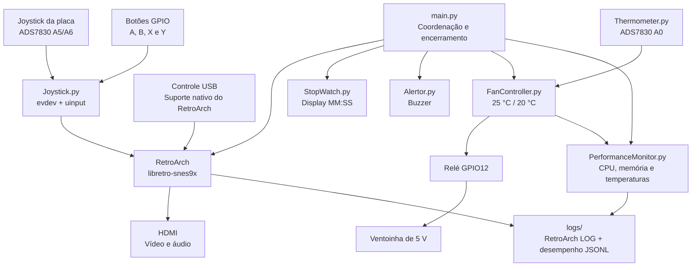

<div align="center">

# UNIVERSIDADE DE SÃO PAULO
## ESCOLA POLITÉCNICA

**Departamento de Engenharia de Computação e Sistemas Digitais (PCS)**

### PCS3732 - Laboratório de Processadores · 2026

**Professores:** Carlos Eduardo Cugnasca · Victor Takashi Hayashi

<br>


<br>

# Emulação de Super Nintendo em Raspberry Pi

**Integração de emulação, controles e periféricos da Freenove Projects Board**

Bruno de Souza Pimentel Lima - NUSP 11375308  
Gabriel Christensen - NUSP 14571293  
Luigi Scofano de Araujo - NUSP 13680334

São Paulo - 2026

</div>


# 1. Motivação e justificativa

O projeto utiliza uma Raspberry Pi 3B+ para emular jogos de Super Nintendo Entertainment System (SNES). A emulação é realizada pelo RetroArch com o núcleo libretro-snes9x, executados sobre um sistema operacional Linux. A Raspberry Pi mantém sua interface e seu sistema operacional convencionais e executa o software de emulação como uma aplicação.

Além da execução dos jogos, o projeto explora os periféricos da Freenove Projects Board. O joystick analógico e quatro botões são usados como entrada; o display de sete segmentos mostra o tempo da sessão; o buzzer informa o início e o encerramento do RetroArch; e o termistor, o conversor ADS7830 e o relé formam um sistema de refrigeração automática com uma ventoinha de 5 V. Durante cada sessão, a aplicação também registra as mensagens do RetroArch e métricas de desempenho da Raspberry Pi.

O projeto constitui um caso prático de integração entre Linux, emulação, barramento I²C, entradas GPIO, acionamento de cargas e execução concorrente de rotinas em Python.

> **Resultado esperado:** uma Raspberry Pi capaz de executar jogos compatíveis de SNES pelo RetroArch e libretro-snes9x, receber comandos da placa ou de um controle USB e coordenar automaticamente os periféricos de indicação e refrigeração.

# 2. Requisitos do sistema

## 2.1 Requisitos funcionais

| ID | Requisito funcional | Prioridade |
|---|---|---|
| RF01 | Executar jogos compatíveis de SNES com o núcleo libretro-snes9x. | Essencial |
| RF02 | Usar o joystick analógico da placa como direcional do RetroArch. | Essencial |
| RF03 | Mapear os botões SNES A, B, X e Y nos GPIOs 16, 21, 26 e 20, respectivamente. | Essencial |
| RF04 | Exibir no display de quatro dígitos o tempo decorrido da sessão em minutos e segundos. | Essencial |
| RF05 | Emitir alertas sonoros curtos ao iniciar e encerrar o RetroArch. | Importante |
| RF06 | Ler periodicamente o termistor integrado por meio do ADS7830 no barramento I²C. | Essencial |
| RF07 | Ligar a ventoinha em 25 °C e desligá-la em 20 °C, aplicando histerese. | Essencial |
| RF08 | Acionar a ventoinha de 5 V pelo relé integrado conectado ao GPIO12. | Essencial |
| RF09 | Registrar em arquivos separados o log do RetroArch e as métricas de desempenho da sessão. | Importante |

## 2.2 Requisitos não funcionais

| ID | Requisito não funcional |
|---|---|
| RNF01 | A emulação deve manter áudio e vídeo estáveis durante a execução normal. |
| RNF02 | A ventoinha deve ser alimentada pelo circuito de 5 V e comutada pelo relé, nunca diretamente pelo GPIO. |
| RNF03 | A leitura da temperatura deve ocorrer em segundo plano, sem imprimir continuamente os valores no terminal. |
| RNF04 | Os GPIOs devem ser liberados e o relé desligado no encerramento normal da aplicação. |
| RNF05 | Uma falha na leitura do termistor deve manter a ventoinha ligada como medida de segurança e emitir apenas a mensagem de erro necessária. |
| RNF06 | As métricas devem ser gravadas em segundo plano sem impressão contínua no terminal. |

# 3. Arquitetura

O `main.py` coordena o ciclo de vida do RetroArch e das rotinas auxiliares. As leituras do joystick, a atualização do display, o controle térmico e o monitoramento de desempenho são executados em threads próprias. O buzzer é acionado diretamente nos eventos de início e encerramento.



## 3.1 Componentes físicos

| Componente | Responsabilidade |
|---|---|
| Raspberry Pi 3B+ | Executar Linux, Python, RetroArch e libretro-snes9x. |
| Cartão microSD | Armazenar o sistema, as configurações. |
| Freenove Projects Board | Disponibilizar joystick, botões, buzzer, display, termistor, ADS7830 e relé. |
| Ventoinha de 5V | Refrigerar o sistema quando acionada pelo relé integrado. |
| Controle USB opcional | Fornecer uma entrada alternativa reconhecida diretamente pelo RetroArch. |
| Monitor HDMI | Reproduzir a interface, o vídeo e o áudio do RetroArch. |

## 3.2 Componentes de software

Os exemplos do [repositório Freenove Projects Kit for Raspberry Pi](https://github.com/Freenove/Freenove_Projects_Kit_for_Raspberry_Pi) foram utilizados como referência para a integração com os componentes da placa.

| Arquivo | Função |
|---|---|
| `src/main.py` | Inicia o RetroArch e coordena o ciclo de vida dos módulos. |
| `src/modules/Joystick.py` | Lê o joystick e os botões e gera entradas de teclado para o RetroArch. |
| `src/modules/utils/ADCDevice.py` | Realiza a comunicação I²C com o conversor ADS7830. |
| `src/modules/StopWatch.py` | Controla o display e calcula o tempo decorrido da sessão. |
| `src/modules/Alertor.py` | Controla os alertas sonoros emitidos pelo buzzer passivo. |
| `src/modules/Thermometer.py` | Lê o termistor e converte o valor obtido em graus Celsius. |
| `src/modules/FanController.py` | Aplica a histerese térmica e controla a ventoinha por meio do relé. |
| `src/modules/PerformanceMonitor.py` | Coleta métricas do RetroArch e da Raspberry Pi e as registra em logs. |
| `scripts/install_dependencies.sh` | Instala as dependências e configura o dispositivo virtual de entrada. |
| `tests/` | Verifica automaticamente as principais regras do software com dispositivos simulados. |
| `pytest.ini` | Define o diretório utilizado na coleta dos testes. |

O RetroArch, o libretro-snes9x e as dependências Python são instalados como pacotes do sistema.

# 4. Entradas e periféricos

## 4.1 Joystick e botões da placa

O joystick é conectado aos canais analógicos A5 e A6 do ADS7830. Os eventos são expostos ao sistema como um teclado virtual por `evdev` e `/dev/uinput`. O mapeamento usa as teclas padrão do RetroArch:

| Comando SNES | Entrada física | Tecla enviada ao RetroArch |
|---|---|---|
| Direcional | Joystick A5/A6 | Setas direcionais |
| A | GPIO16 | `X` |
| B | GPIO21 | `Z` |
| X | GPIO26 | `S` |
| Y | GPIO20 | `A` |

Dada a limitação de botões da placa, demais comandos do controle SNES não estão mapeados nesta versão. Um controle USB pode fornecer esses comandos adicionais e não depende de `uinput`.

## 4.2 Display de sete segmentos

O display de quatro dígitos é controlado pelo 74HC595 usando GPIO22 para dados, GPIO27 para latch e GPIO17 para clock. Enquanto o RetroArch está aberto, `StopWatch.py` mostra o tempo decorrido no formato `MM:SS`. O display é apagado no encerramento.

## 4.3 Buzzer

O buzzer passivo usa o GPIO4. Duas notas ascendentes indicam o início do RetroArch e as mesmas notas em ordem descendente indicam seu encerramento.

## 4.4 Termômetro e ventoinha

O termistor ocupa o canal A0 do ADS7830, no endereço I²C `0x48`. A conversão para graus Celsius é feita no `Thermometer.py`.

O `FanController.py` consulta a temperatura a cada 0,5 segundo. O relé do GPIO12 é ligado quando a temperatura atinge ou ultrapassa 25 °C e permanece ligado até que a leitura seja igual ou inferior a 20 °C. Em caso de erro de leitura, a rotina liga a ventoinha como medida de segurança e informa a falha no fluxo de erro do programa.

O controlador é iniciado pelo `main.py` junto com os demais módulos. A leitura térmica ocorre em uma thread própria durante toda a sessão do RetroArch. No encerramento, a thread é finalizada, o relé é desligado e os recursos do termômetro são liberados.

Para evitar conflitos entre periféricos que compartilham GPIOs na placa, a chave `3 — Active Buzzer` deve permanecer desligada e a chave `4 — Relay` ligada. O LED D7 acompanha o estado do relé e indica visualmente quando a ventoinha está em funcionamento.

## 4.5 Registro de desempenho

Ao iniciar uma sessão, o `main.py` cria dois arquivos no diretório `logs/`, ambos identificados pela mesma data e horário. O arquivo `retroarch-<sessão>.log` recebe o log nativo do RetroArch, iniciado em modo verboso. O arquivo `performance-<sessão>.jsonl` recebe uma amostra por segundo produzida pelo `PerformanceMonitor.py`.

Cada linha do JSONL contém um objeto independente com horário, tempo decorrido, PID, uso de CPU e memória do processo RetroArch, uso geral de CPU e memória, temperatura do processador, leitura disponibilizada pelo termistor e estado da ventoinha. As métricas de processo e sistema são obtidas por `psutil`; a temperatura do processador é lida pela interface térmica do Linux, enquanto a temperatura da placa e o estado do relé são compartilhados pelo `FanController.py`, sem uma segunda leitura do ADS7830.

Cada registro é persistido imediatamente, reduzindo a perda de dados em caso de interrupção. O monitor é encerrado junto com o RetroArch e não imprime as amostras no terminal. Os arquivos produzidos em `logs/` são ignorados pelo Git.


# 5. Mapa de conexões

Todos os números abaixo seguem a numeração BCM dos GPIOs.

| Recurso | GPIO ou canal |
|---|---|
| I²C SDA / SCL | GPIO2 / GPIO3 |
| Buzzer passivo | GPIO4 |
| Relé da ventoinha | GPIO12 |
| Botão SNES A | GPIO16 |
| Clock do display | GPIO17 |
| Botão SNES Y | GPIO20 |
| Botão SNES B | GPIO21 |
| Dados do display | GPIO22 |
| Botão SNES X | GPIO26 |
| Latch do display | GPIO27 |
| Termistor | ADS7830 A0 |
| Eixo X do joystick | ADS7830 A5 |
| Eixo Y do joystick | ADS7830 A6 |

# 6. Testes automatizados

Os módulos foram organizados para separar as decisões do software do acesso direto ao hardware. ADC, termômetro, relé, botões, teclado virtual, pinos do display, processo do RetroArch e coletor de métricas podem ser substituídos por objetos simulados.

A suíte utiliza `pytest` e está localizada em `tests/`. Ela verifica:

- os limites de 25 °C e 20 °C, a histerese e o acionamento seguro da ventoinha em caso de erro;
- a conversão das leituras do termistor para graus Celsius e a rejeição de valores inválidos;
- a zona morta, a orientação dos eixos e o mapeamento dos quatro botões;
- a conversão do tempo decorrido para os quatro dígitos do display;
- a geração dos registros JSONL e as métricas associadas à sessão;
- a inicialização e o encerramento dos módulos coordenados pelo `main.py`.

Os testes são executados com:

```bash
python3 -m pytest
```

Essa verificação isolada complementa os ensaios funcionais realizados na Raspberry Pi com o termistor, relé, ventoinha, display, buzzer e controles reais.

# 7. Instalação e execução

O script `scripts/install_dependencies.sh` instala `retroarch`, `libretro-snes9x`, `i2c-tools`, `python3-smbus`, `python3-gpiozero`, `python3-evdev`, `python3-psutil` e `python3-pytest`. O pacote `i2c-tools` é usado para diagnóstico do barramento, especialmente pelo comando `i2cdetect`, e não participa diretamente das leituras durante a execução.

O mesmo instalador carrega o módulo `uinput`, registra seu carregamento em `/etc/modules-load.d/labproc-uinput.conf`, cria a regra `/etc/udev/rules.d/99-labproc-uinput.rules` para `/dev/uinput` e adiciona o usuário ao grupo `input`. Depois dessa configuração inicial é necessário reiniciar a sessão do usuário ou a Raspberry Pi.

```bash
bash scripts/install_dependencies.sh
sudo raspi-config
sudo reboot
```

O I²C deve ser habilitado em `raspi-config`.

```bash
python3 src/main.py
```

O `main.py` abre a interface normal do RetroArch. O núcleo libretro-snes9x e o jogo devem ser selecionados no próprio RetroArch. Nenhuma ROM é distribuída pelo projeto.

# 8. Estado atual do projeto

A versão final integra a emulação, o joystick, os botões GPIO, o display, o buzzer, o termômetro, o controle automático da ventoinha e o registro de desempenho. O conjunto está funcional na Raspberry Pi com os periféricos conectados: o RetroArch é iniciado pelo `main.py`, as entradas controlam o emulador, o tempo da sessão é exibido, os alertas sonoros são emitidos, a refrigeração responde aos limites definidos de temperatura e cada sessão produz logs próprios para diagnóstico e análise.
