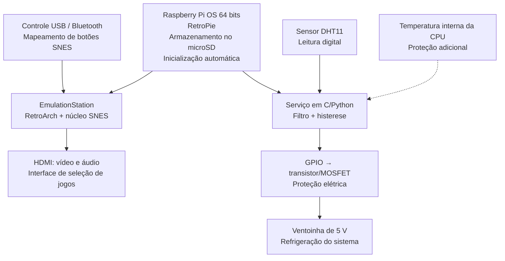

# UNIVERSIDADE DE SÃO PAULO
## ESCOLA POLITÉCNICA

**Departamento de Engenharia de Computação e Sistemas Digitais (PCS)**

### PCS3732 - Laboratório de Processadores · 2026

**Professores:** Carlos Eduardo Cugnasca · Victor Takashi Hayashi

 

 

# Emulador Super Nintendo

**Sistema de emulação em Raspberry Pi com refrigeração ativa controlada por sensor**

Bruno de Souza Pimentel Lima - NUSP 11375308  
Gabriel Christensen - NUSP 14571293  
Luigi Scofano de Araujo - NUSP 13680334

São Paulo - 2026

# 1. Motivação e justificativa

O projeto propõe transformar o Raspberry Pi em um console dedicado à emulação do Super Nintendo, utilizando Raspberry Pi OS e RetroPie como base de software. Além de recuperar uma plataforma clássica de jogos em um equipamento compacto, o sistema cria um caso prático de integração entre sistema operacional, processamento multimídia, interfaces de entrada e controle de periféricos.

A execução contínua de emuladores exige processamento gráfico e de áudio, podendo elevar a temperatura do sistema e reduzir o desempenho por limitação térmica. Para tratar esse problema, a placa será usada como interface para a leitura do sensor DHT11 e o controle da ventoinha. O projeto passa, portanto, a incluir um laço embarcado completo: medição, decisão e acionamento. A temperatura interna da CPU poderá atuar como proteção adicional, sem substituir o sensor DHT11.

> **Resultado esperado:** um console que inicializa diretamente na interface do RetroPie, executa jogos compatíveis de SNES com controle externo e ajusta automaticamente a refrigeração conforme a temperatura medida.

# 2. Requisitos do sistema

## 2.1 Requisitos funcionais

| ID | Requisito funcional | Prioridade |
|---|---|---|
| RF01 | Inicializar o Raspberry Pi OS e abrir automaticamente a interface do RetroPie/EmulationStation. | Essencial |
| RF02 | Executar jogos compatíveis de Super Nintendo por meio do RetroArch e de um núcleo SNES configurado. | Essencial |
| RF03 | Reconhecer ao menos um controle USB ou Bluetooth e permitir o mapeamento dos comandos direcionais e botões. | Essencial |
| RF04 | Ler periodicamente a temperatura e a umidade fornecidas pelo sensor DHT11 conectado à placa. | Essencial |
| RF05 | Ligar a ventoinha quando a temperatura ultrapassar o limite superior e desligá-la somente abaixo do limite inferior, aplicando histerese. | Essencial |
| RF06 | Registrar temperatura, estado da ventoinha e eventuais falhas em arquivo de log acessível pelo sistema. | Importante |

## 2.2 Requisitos não funcionais

| ID | Requisito não funcional |
|---|---|
| RNF01 | A emulação deve manter áudio e vídeo estáveis, sem travamentos perceptíveis durante a execução normal. |
| RNF03 | A ventoinha de 5 V não pode ser alimentada diretamente por GPIO; o acionamento deve usar transistor ou MOSFET e terra comum. |
| RNF04 | Os limites térmicos devem ser configuráveis; referência inicial: liga em 55 °C e desliga em 48 °C. |
| RNF05 | O software de controle térmico deve executar como serviço independente do emulador e reiniciar automaticamente em caso de falha. |

# 3. Arquitetura proposta

A arquitetura é dividida em dois fluxos paralelos. O primeiro executa a experiência de jogo: o usuário interage por um controle, a interface EmulationStation seleciona o título e o RetroArch executa o núcleo de emulação, enviando vídeo e áudio pela saída HDMI. O segundo fluxo é responsável pelo gerenciamento térmico, independentemente do emulador.

## Arquitetura física e de software

## 3.1 Componentes e responsabilidades

| Componente | Responsabilidade |
|---|---|
| Raspberry Pi 3B+/4 | Executar o sistema operacional, o RetroPie, o emulador e o serviço de controle térmico. |
| Cartão microSD | Armazenar Raspberry Pi OS, configurações, temas, logs e jogos legalmente obtidos. |
| Placa | Interligar o sensor DHT11 e o circuito de acionamento da ventoinha ao Raspberry Pi. |
| Ventoinha de 5 V | Remover calor do dissipador do sistema; acionada por estágio de potência controlado por GPIO. |
| Controle USB/Bluetooth | Fornecer comandos equivalentes ao controle original do SNES. |
| Monitor/TV HDMI | Apresentar a interface de seleção e a saída audiovisual dos jogos. |

## 3.2 Lógica de controle da ventoinha

O serviço térmico realiza leituras periódicas, aplica filtragem para reduzir oscilações e compara o valor com dois limiares. Ao atingir o limite superior, o GPIO aciona o estágio de potência e liga a ventoinha. Ela permanece ligada até que a temperatura fique abaixo do limite inferior. Essa histerese evita comutações rápidas e prolonga a vida útil do atuador. Uma condição de temperatura crítica deve manter a ventoinha ligada e registrar um alerta, mesmo que o RetroPie seja encerrado.
